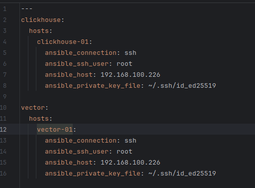
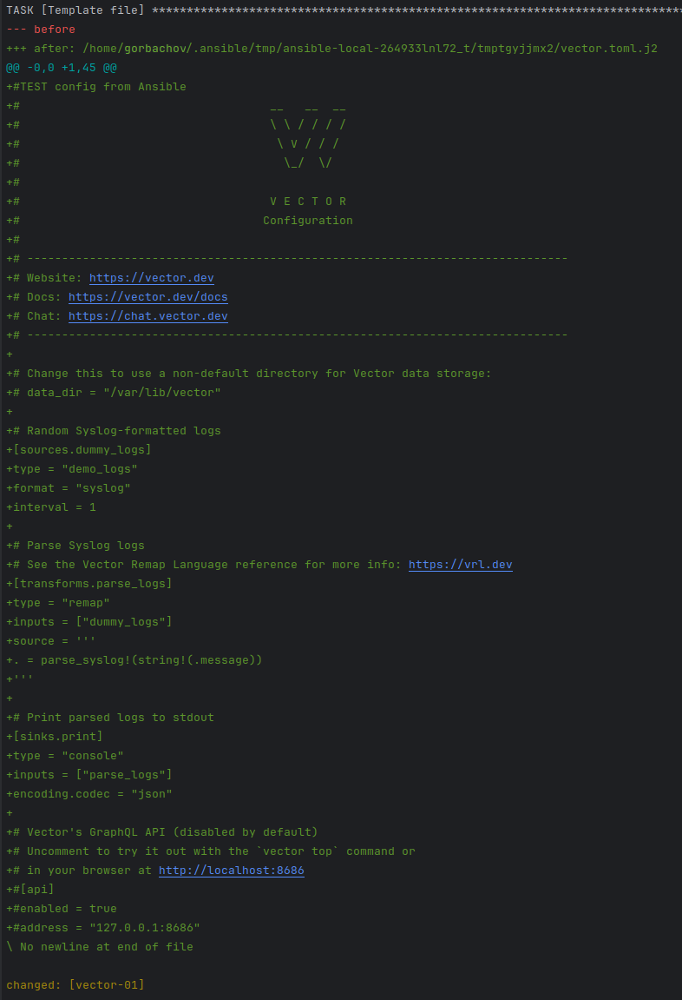

# Домашнее задание к занятию 2 «Работа с Playbook» - `Горбачев Олег`

## Подготовка к выполнению

1. * Необязательно. Изучите, что такое [ClickHouse](https://www.youtube.com/watch?v=fjTNS2zkeBs) и [Vector](https://www.youtube.com/watch?v=CgEhyffisLY).
2. Создайте свой публичный репозиторий на GitHub с произвольным именем или используйте старый.
3. Скачайте [Playbook](./playbook/) из репозитория с домашним заданием и перенесите его в свой репозиторий.
4. Подготовьте хосты в соответствии с группами из предподготовленного playbook.

## Основная часть

1. Подготовьте свой inventory-файл `prod.yml`.
2. Допишите playbook: нужно сделать ещё один play, который устанавливает и настраивает [vector](https://vector.dev). Конфигурация vector должна деплоиться через template файл jinja2. От вас не требуется использовать все возможности шаблонизатора, просто вставьте стандартный конфиг в template файл. Информация по шаблонам по [ссылке](https://www.dmosk.ru/instruktions.php?object=ansible-nginx-install). не забудьте сделать handler на перезапуск vector в случае изменения конфигурации!
3. При создании tasks рекомендую использовать модули: `get_url`, `template`, `unarchive`, `file`.
4. Tasks должны: скачать дистрибутив нужной версии, выполнить распаковку в выбранную директорию, установить vector.
5. Запустите `ansible-lint site.yml` и исправьте ошибки, если они есть.
6. Попробуйте запустить playbook на этом окружении с флагом `--check`.
7. Запустите playbook на `prod.yml` окружении с флагом `--diff`. Убедитесь, что изменения на системе произведены.
8. Повторно запустите playbook с флагом `--diff` и убедитесь, что playbook идемпотентен.
9. Подготовьте README.md-файл по своему playbook. В нём должно быть описано: что делает playbook, какие у него есть параметры и теги. Пример качественной документации ansible playbook по [ссылке](https://github.com/opensearch-project/ansible-playbook). Так же приложите скриншоты выполнения заданий №5-8
10. Готовый playbook выложите в свой репозиторий, поставьте тег `08-ansible-02-playbook` на фиксирующий коммит, в ответ предоставьте ссылку на него.

---

## Решение основной части

1. Подготовил свой inventory-файл `prod.yml`:

Использовать буду виртуальную машину Centos 7, созданную в VirtualBox.

2 - 4. Дописал playbook для установки Vector. Playbook использует модули `get_url`, `template`, `unarchive`, `file` и `shell`

Выполняется скачивание, разархивирование в указанную директорию, добавление конфигурации из файла шаблона и запуск Vector.

5. Запустил `ansible-lint site.yml`, увидел наличие ошибок. В моем случае в playbook отсутствовали права на скачиваемые и исполняемые файлы, были лишние отступы в коде, использовался устаревший синтаксис, а также был исправлен порядок запуска сервиса Clickhouse.

6. Запускаю playbook с флагом `--check`. Флаг `--check` не вносит изменения в конечную систему. Выполнение плейбука невозможно с этим флагом, т.к. нет скачанных файлов дистрибутива, а значит нечего устанавливать:

7. Запускаю playbook с флагом `--diff`. Этот флаг позволяет отслеживать изменения в файлах на удаленных хостах, чтобы можно было видеть, какие конкретные изменения будут внесены на хостах в результате выполнения плейбука.

В моем случае был создан файл следующего содержания:

8. Повторно запускаю playbook с флагом `--diff`, вижу, что playbook идемпотентен, за исключением запуска Vector:

9. Ссылка на описание Playbook: https://github.com/RikLedger/08-ansible-02-playbook-hw/blob/main/SRC/playbook%20/README.md
